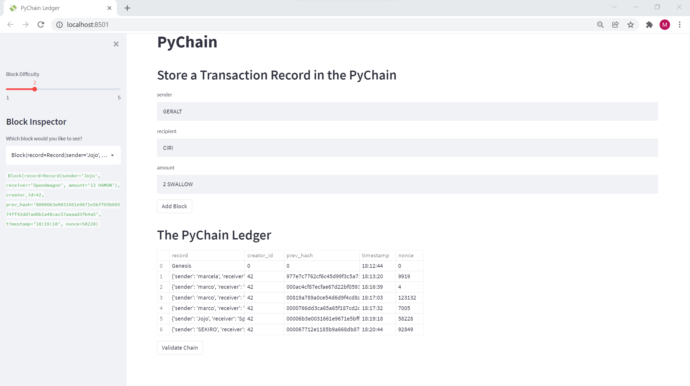
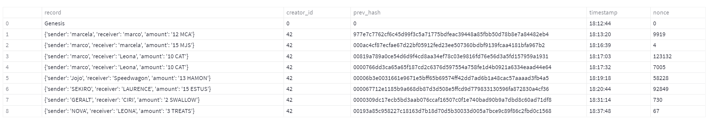
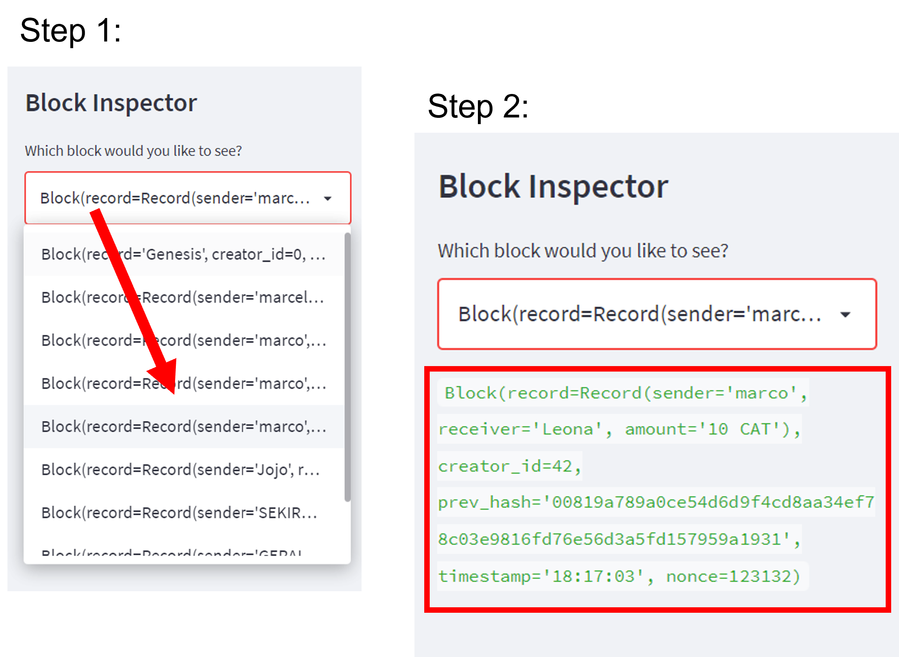
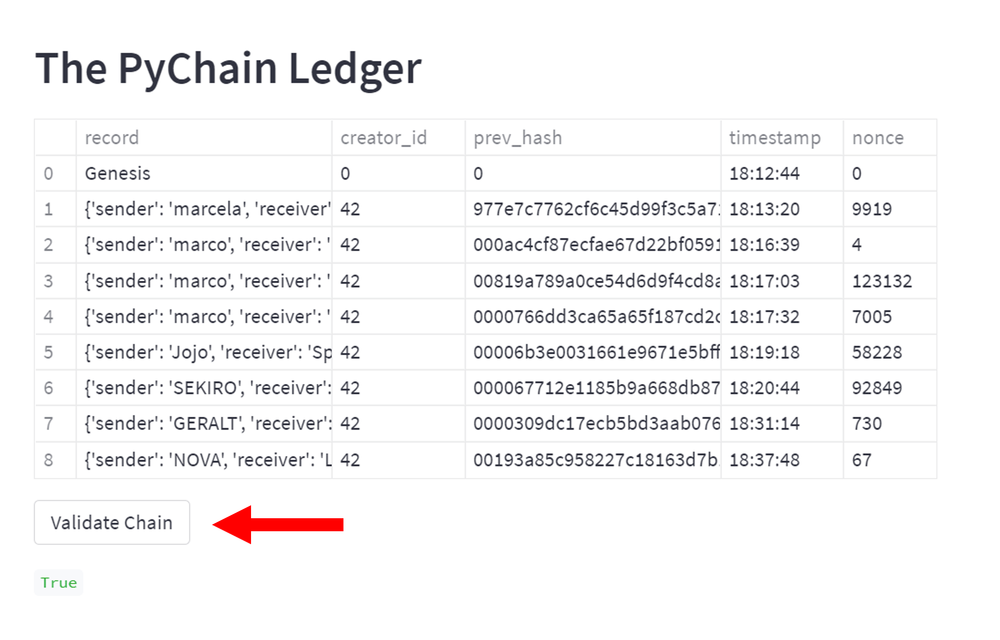

# PyChain Ledger 🔗 test

- Python blockchain-based ledger system, complete with a user-friendly web interface built with Streamlit.

- Source code: [PyChain App](pychain.py)

# Here's How it Works 👇

## Store Transactions on the Blockchain

- Set `block difficulty` with the slider to the left
- Fill in the `sender`, `recipient` and `amount` fields
- Click on the `Add Block` button

Expand to full view ↕ of the ledger:

## Check Previous Transactions

Choose a block from the dropdown menu and review the block's data:

## Validate Ledger

Validate transactions by clicking on the `Validate` button:

